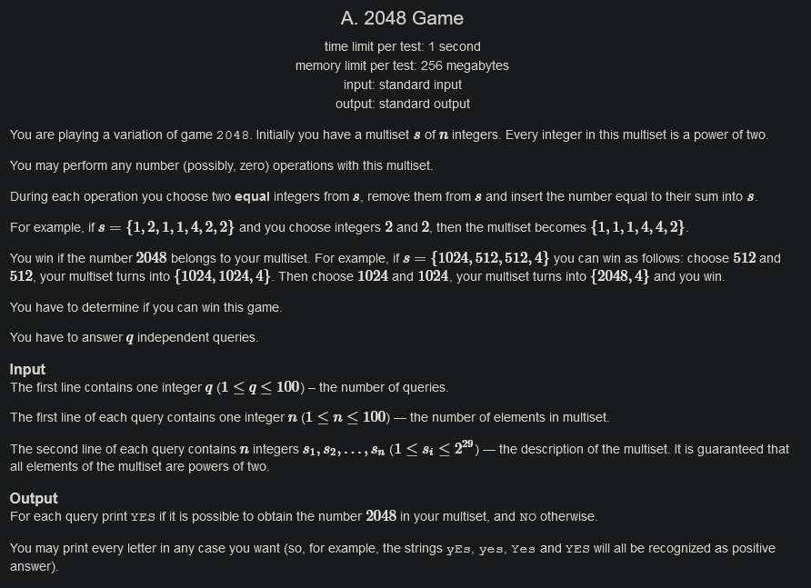
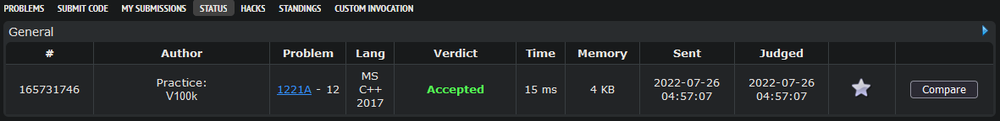
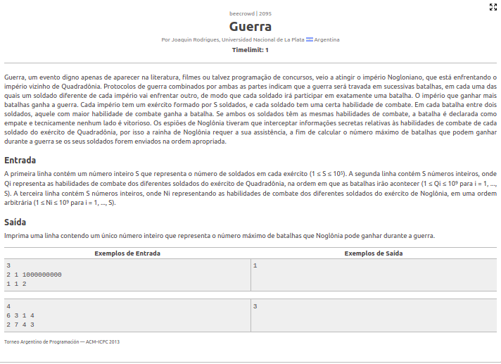
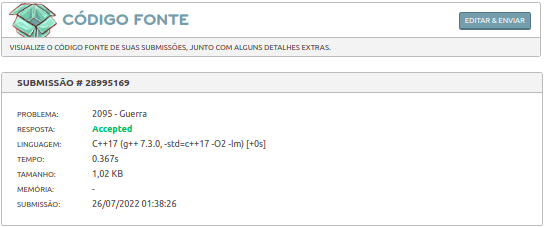
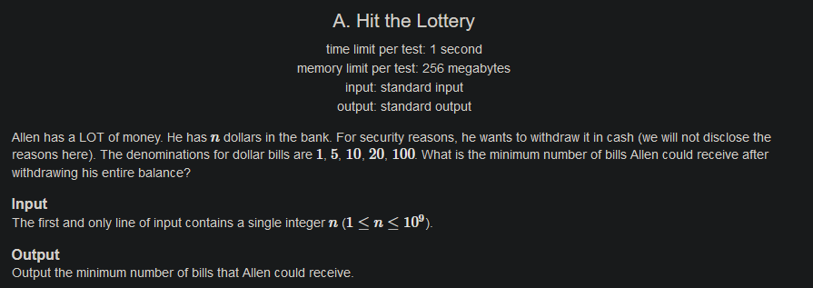
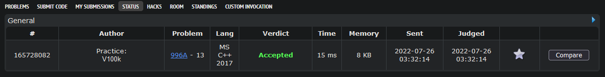

# Exercícios Resolvidos

**Conteúdo da Disciplina**: Greed 

## Alunos
|Matrícula | Aluno |
| -- | -- |
| 180149598  |  Victor Hugo SIqueira Costa |
| 180029240  |  Wesley Pedrosa dos Santos |

## Sobre 
Solução de exercícios sobre Algoritmos Ambiciosos pela dupla 12 (Victor Hugo, Wesley Santos). Foram utilizadas as plataformas *beecrowd* e *Codeforces*.

## Screenshots
[2048 Game](https://codeforces.com/contest/1221/problem/A) 
 
 

[Guerra](https://www.beecrowd.com.br/judge/pt/problems/view/2095) 
 
 

[Hit the Lottery](https://codeforces.com/problemset/problem/996/A) 
 
 

## Instalação e Uso
**Linguagem**: C++ 
Para testar os códigos e conseguir os *aceppted* basta ir no link de cada um dos exercícios e submeter o respectivo código para a plataforma poder avaliar 
